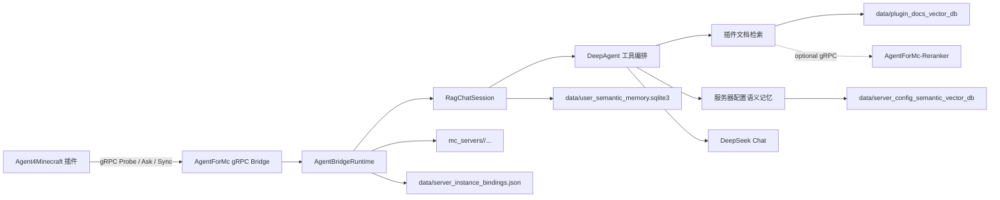

# AgentForMc

AgentForMc 是 Agent4Minecraft 项目的 AI 后端。它通过 gRPC 接收 Minecraft 插件端发来的玩家问题和服务器配置同步请求，负责问题规划、插件文档检索、服务端配置语义记忆、答案生成和同步状态管理。

本仓库是后端大脑，不直接运行在 Minecraft 服务端里；Minecraft 侧入口由插件仓库 Agent4Minecraft 提供。

## 关联仓库

| 仓库 | 职责 | 地址                                               |
| --- | --- |--------------------------------------------------|
| AgentForMc | AI 后端，负责 gRPC 服务、RAG、DeepAgent、语义记忆和配置摄取 |                                                  |
| Agent4Minecraft | Minecraft 插件端，负责游戏内命令、配置扫描、脱敏和文件上传 | <https://github.com/EternalmBlue/Agent4Minecraft> |
| AgentForMc-Reranker | 可选 reranker 中间件，单独承载 BCE 模型和重排 gRPC 服务 | <https://github.com/EternalmBlue/AgentForMc-Reranker> |

两个仓库通过同一份 gRPC 协议对接：

- 后端协议文件：`agent_for_mc/interfaces/grpc/agent_bridge.proto`
- 插件端协议文件：`src/main/proto/agent_bridge.proto`
- 默认 gRPC 地址：`127.0.0.1:50051`
- 认证方式：业务 RPC 需要 `authorization: Bearer <token>`
- `Probe` 用于启动探测，不要求认证，但会校验服务端身份绑定

## 功能概览

- gRPC 桥接服务：提供 `AgentBridgeService`，供 Minecraft 插件调用。
- 玩家问答：处理 `/askmc <问题>` 转发来的问题，返回最终答案和引用摘要。
- DeepAgent 工作流：组合规划、检索、查询改写、HyDE、多查询、质量判断等工具。
- 插件文档 RAG：基于 LanceDB 的插件文档向量检索，支持向量检索、名称命中增强和 BM25。
- 可选远程 reranker：可连接 AgentForMc-Reranker 中间件对候选文档重排；中间件不可用时自动降级。
- 服务端配置摄取：接收插件上传的服务器配置和插件配置。
- 增量同步：根据 manifest 判断哪些文件需要上传。
- 分块上传：通过 client-streaming gRPC 接收文件块并校验 SHA-256。
- 语义配置记忆：把上传后的 Minecraft 配置抽取为可检索的语义记忆。
- 用户长期记忆：可选开启玩家维度长期语义记忆。
- 服务端实例绑定：用 `server.id` + `server_instance_id` 防止多个服务器误用同一身份。
- 可观测性：可选接入 LangSmith 和 OpenTelemetry。

## 整体架构



主要模块：

| 模块 | 说明 |
| --- | --- |
| `main.py` | 默认启动入口，启动 gRPC bridge |
| `agent_for_mc/interfaces/grpc` | gRPC proto、生成代码、服务实现、运行时编排 |
| `agent_for_mc/interfaces/deepagent` | DeepAgent 构建、主 agent、子 agent 和提示词 |
| `agent_for_mc/interfaces/tools` | 检索、路由、查询改写、语义配置、刷新等工具 |
| `agent_for_mc/application` | Chat session、RAG 检索、插件配置语义抽取和长期记忆服务 |
| `agent_for_mc/infrastructure` | 配置、API 客户端、LanceDB、远程 reranker 客户端、可观测性 |
| `agent_for_mc/domain` | 领域模型和错误类型 |
| `tests` | gRPC、工具、语义扫描、可观测性相关测试 |

## 环境要求

- Python 3.11+ 推荐
- 可访问 DeepSeek Chat API
- 可访问智谱 OpenAI-compatible embedding API
- 已准备好的插件文档 LanceDB 向量库
- 与插件端一致的 gRPC token

核心 Python 依赖见 `requirements.txt`，包括：

- `grpcio` / `grpcio-tools`
- `lancedb`
- `pyarrow`
- `langchain-core`
- `langchain-deepseek`
- `deepagents`
- `requests`
- `langsmith`
- `opentelemetry-*`

## 快速开始

### 1. 克隆仓库

```powershell
git clone https://github.com/EternalmBlue/Agent4Minecraft.git
git clone https://github.com/EternalmBlue/AgentForMc-Reranker.git
```

建议先把后端和 Minecraft 服务端部署在同一台机器上，使用默认的 `127.0.0.1:50051` 完成本地联调。

### 2. 创建 Python 环境

Windows PowerShell：

```powershell
cd AgentForMc
python -m venv .venv
.\.venv\Scripts\Activate.ps1
pip install -r requirements.txt
```

Linux / macOS：

```bash
cd AgentForMc
python -m venv .venv
source .venv/bin/activate
pip install -r requirements.txt
```

### 3. 配置密钥

复制环境变量模板：

```powershell
Copy-Item .env.example .env
```

Linux / macOS：

```bash
cp .env.example .env
```

编辑 `.env`：

```dotenv
RAG_ZHIPU_API_KEY=你的智谱APIKey
RAG_DEEPSEEK_API_KEY=你的DeepSeekAPIKey
RAG_GRPC_AUTH_TOKEN=change_me_to_a_strong_token
RAG_RERANKER_GRPC_AUTH_TOKEN= # 仅启用远程 reranker 时需要
```

`RAG_GRPC_AUTH_TOKEN` 必须和插件端 `plugins/Agent4Minecraft/config.yml` 中的 `backend.authToken` 一致。

### 4. 准备插件文档向量库

后端启动时会校验插件文档向量库。默认路径是：

```text
data/plugin_docs_vector_db
```

默认表名是：

```text
plugin_docs
```

该 LanceDB 表需要包含以下字段：

```text
id
content
plugin_chinese_name
plugin_english_name
embedding
```

`embedding` 字段维度必须和 `config.toml` 中的 `embedding.dimensions` 一致，默认是 `1024`。如果公开仓库没有包含 `data/`，部署时需要单独准备或恢复这份向量库数据；否则启动会报 `Lance 数据库目录不存在` 或无法打开表。

### 5. 启动 gRPC 后端

```powershell
python main.py
```

也可以使用模块入口：

```powershell
python -m agent_for_mc.interfaces.grpc
```

默认监听：

```text
127.0.0.1:50051
```

启动成功后，Minecraft 插件启动时会调用 `Probe`，日志中应能看到后端名称、协议版本和连接结果。

### 可选：启用远程 reranker

如果需要 reranker，先启动独立中间件，再启动本后端：

```powershell
cd AgentForMc-Reranker
$env:RAG_RERANKER_GRPC_AUTH_TOKEN="change_me_to_a_strong_token"
python main.py
```

然后在本后端设置同一个 `RAG_RERANKER_GRPC_AUTH_TOKEN`，并把 `config.toml` 的 `[reranker].enabled` 改为 `true`。如果中间件未启动、超时或返回错误，后端会记录失败并降级使用 BM25/vector 融合结果。

## 与插件端联调

插件仓库地址：

```text
https://github.com/EternalmBlue/Agent4Minecraft
```

插件端最小配置：

```yaml
backend:
  authToken: "change_me_to_a_strong_token"
```

如果 Minecraft 服务端和后端不在同一台机器上，请让后端监听外部地址：

```toml
[grpc]
host = "0.0.0.0"
port = 50051
```

并在插件端配置后端地址：

```yaml
backend:
  authToken: "change_me_to_a_strong_token"
  host: "后端机器IP"
  port: 50051
```

联调顺序：

1. 启动 AgentForMc 后端。
2. 构建并安装 Agent4Minecraft 插件。
3. 启动 Paper 服务端，确认插件启动探测成功。
4. 在游戏内执行 `/a4m sync` 上传配置。
5. 使用 `/a4m status` 查看后端索引刷新状态。
6. 使用 `/askmc <问题>` 验证问答结果。

## 配置说明

后端配置由两部分组成：

- `.env`：只放密钥和敏感值。
- `config.toml`：放非敏感运行时配置和默认值覆盖。

也可以通过环境变量 `RAG_CONFIG_TOML` 指定其他 TOML 配置文件路径。

### 环境变量

| 变量 | 必需 | 说明 |
| --- | --- | --- |
| `RAG_ZHIPU_API_KEY` | 是 | 智谱 embedding API Key |
| `RAG_DEEPSEEK_API_KEY` | 是 | DeepSeek Chat API Key |
| `RAG_GRPC_AUTH_TOKEN` | 是 | 插件调用 gRPC 业务接口的 Bearer token |
| `RAG_RERANKER_GRPC_AUTH_TOKEN` | 启用 reranker 时是 | 后端调用 AgentForMc-Reranker 的 Bearer token |
| `RAG_CONFIG_TOML` | 否 | 覆盖默认 `config.toml` 路径 |
| `RAG_LANGSMITH_API_KEY` | 否 | LangSmith 可观测性密钥 |
| `RAG_OTEL_EXPORTER_OTLP_HEADERS` | 否 | OpenTelemetry OTLP headers |

### 常用 config.toml 配置段

`config.toml` 默认只覆盖少量值，更多配置可以按需添加：

```toml
[grpc]
host = "127.0.0.1"
port = 50051
max_workers = 8
session_ttl_seconds = 1800
sync_ttl_seconds = 3600
upload_tmp_dir = ".cache/grpc_uploads"

[embedding]
url = "https://open.bigmodel.cn/api/paas/v4/embeddings"
model = "embedding-3"
dimensions = 1024

[deepseek]
model = "deepseek-chat"
chat_url = "https://api.deepseek.com/chat/completions"

[paths]
plugin_docs_vector_db_dir = "data/plugin_docs_vector_db"
model_cache_dir = ".cache/models"

[plugin_docs_store]
table_name = "plugin_docs"
retrieval_top_k = 5
answer_top_k = 4
bm25_enabled = true
bm25_top_k = 7
bm25_auto_create_index = true

[server_config_semantic_store]
db_dir = "data/server_config_semantic_vector_db"
table_name = "server_config_semantic_memories"
top_k = 8
preview_chars = 220

[plugin_semantic_agent]
mc_servers_root = "mc_servers"
scan_on_startup = true
refresh_interval_seconds = 1800
max_file_chars = 12000
max_files_per_plugin = 20

[memory]
enabled = false
db_path = "data/user_semantic_memory.sqlite3"

[reranker]
enabled = false
host = "127.0.0.1"
port = 50052
timeout_seconds = 10

[server_identity]
bindings_path = "data/server_instance_bindings.json"
```

智谱 `embedding-3` 的 `dimensions` 只支持：

```text
256
512
1024
2048
```

如果修改维度，需要重建已有 LanceDB 向量表。

## 数据目录

| 路径 | 说明 |
| --- | --- |
| `data/plugin_docs_vector_db` | 插件文档向量库，启动时必需 |
| `data/server_config_semantic_vector_db` | 上传配置抽取后的语义记忆向量库 |
| `data/user_semantic_memory.sqlite3` | 可选的用户长期语义记忆 |
| `data/server_instance_bindings.json` | `server.id` 与 `server_instance_id` 的绑定关系 |
| `mc_servers/<server.id>/...` | 插件上传后的 Minecraft 服务端配置文件 |
| `.cache/grpc_uploads` | gRPC 文件上传临时目录 |
| `.cache/models` | 后端模型相关缓存；reranker 模型缓存在 AgentForMc-Reranker 进程侧 |

`data/`、`.cache/`、`mc_servers/` 和 `.env` 默认不应该提交到公开仓库。

## gRPC 服务

服务名：

```proto
service AgentBridgeService
```

RPC：

| RPC | 类型 | 认证 | 说明 |
| --- | --- | --- | --- |
| `Probe` | unary | 不需要 Bearer token | 启动探测，返回后端名称和协议版本，并校验服务端身份 |
| `Ask` | unary | 需要 | 接收玩家问题，返回答案和引用摘要 |
| `PrepareSync` | unary | 需要 | 接收文件 manifest，返回需要上传的路径 |
| `UploadFileChunk` | client-streaming | 需要 | 接收单个文件的分块上传 |
| `CommitSync` | unary | 需要 | 提交同步并触发语义刷新 |
| `GetSyncStatus` | unary | 需要 | 查询同步和刷新进度 |

业务接口认证规则：

```text
authorization: Bearer <RAG_GRPC_AUTH_TOKEN>
```

当前桥接协议版本：

```text
1
```

改动 proto 时需要同步更新：

- `agent_for_mc/interfaces/grpc/agent_bridge.proto`
- `agent_for_mc/interfaces/grpc/agent_bridge_pb2.py`
- `agent_for_mc/interfaces/grpc/agent_bridge_pb2_grpc.py`
- Agent4Minecraft 仓库中的 `src/main/proto/agent_bridge.proto`
- 两边的 gRPC 测试

## 配置同步流程

插件端不会盲目上传整个服务器目录。后端只接受允许范围内的相对路径：

- `plugins/` 下的 `.yml` / `.yaml` / `.json` / `.properties` / `.txt` / `.md`
- 根目录下的 `server.properties`
- 根目录下的 `bukkit.yml`
- 根目录下的 `spigot.yml`
- 根目录下匹配 `paper*.yml` 的 Paper 配置

后端处理流程：

1. `PrepareSync` 校验 manifest 路径、大小、SHA-256 和重复项。
2. 后端比较 `mc_servers/<server.id>/...` 中已有文件，只返回需要上传的路径。
3. `UploadFileChunk` 接收分块并校验 chunk 顺序、文件路径、总块数和 SHA-256。
4. 文件通过临时路径写入，校验成功后原子替换到 `mc_servers/<server.id>/...`。
5. `CommitSync` 校验已上传文件列表与后端记录一致。
6. 如果有变更文件，后端启动增量语义刷新。
7. `GetSyncStatus` 返回上传进度、刷新进度和最终状态。

## 问答流程

`Ask` 请求来自插件的 `/askmc <问题>`，主要字段包括：

- `server_id`
- `server_instance_id`
- `player_id`
- `player_name`
- `question`
- `request_id`
- `timestamp`
- `installed_plugins`

后端处理过程：

1. 校验 `server_id` 与 `server_instance_id` 绑定关系。
2. 按 `server_id:player_id` 或 `server_id:player_name` 建立会话作用域。
3. 读取可选长期记忆上下文。
4. 记录当前问题和已安装插件列表到 turn context。
5. 调用 DeepAgent 执行规划、检索和回答生成。
6. 汇总引用来源，返回 `AskResponse`。
7. 可选写入长期记忆。

## 服务端身份绑定

后端会维护：

```text
data/server_instance_bindings.json
```

绑定格式以 `server.id` 为键，记录插件端生成的 `server_instance_id`。这样可以防止两个不同 Minecraft 服务端误用同一个 `server.id`，导致上传配置和语义记忆串服。

如果确实迁移了服务端，并且确认旧实例不会再使用同一个 `server.id`，可以停止后端后清理对应绑定，再重新启动。

## 本地开发

运行测试：

```powershell
pytest
```

或指定测试文件：

```powershell
pytest tests/test_grpc_bridge.py
pytest tests/test_plugin_semantic_scanner.py
pytest tests/test_graph_and_tools.py
pytest tests/test_observability.py
```

建议重点覆盖：

- gRPC 认证和状态码映射
- `Probe` 免认证但校验服务端身份
- manifest 路径校验和重复路径处理
- 分块上传与 SHA-256 校验
- `CommitSync` 和 `GetSyncStatus`
- 插件配置语义扫描和增量刷新
- DeepAgent 工具注册和路由

## 可观测性

后端代码中已经为主要链路埋点：

- gRPC bridge
- session ask
- retrieval
- embedding
- DeepSeek chat
- plugin semantic refresh
- tool 调用

可通过 `.env` 和 `config.toml` 启用 LangSmith 或 OpenTelemetry：

```toml
[observability]
langsmith_enabled = true
otel_enabled = true
```

相关密钥继续放在 `.env` 中。

## 生产部署建议

- 不要使用示例 token，生产环境必须修改 `RAG_GRPC_AUTH_TOKEN`。
- 插件端 `backend.authToken` 必须和后端 token 完全一致。
- 如果 gRPC 需要跨机器访问，请用防火墙限制来源 IP。
- 公网部署建议额外使用 TLS / mTLS 或放在受控内网网关后面。
- 不要把 `.env`、`data/`、`.cache/`、`mc_servers/`、模型缓存提交到公开仓库。
- 为不同 Minecraft 服务器配置不同 `server.id`。
- 修改 `embedding.dimensions` 后必须重建相关向量表。
- 公开分发时建议提供独立的数据初始化或向量库构建说明。

## 常见问题

### 启动时报 Missing environment variable RAG_DEEPSEEK_API_KEY

后端没有读取到 DeepSeek API Key。确认 `.env` 存在，且包含：

```dotenv
RAG_DEEPSEEK_API_KEY=...
```

### 启动时报 Missing embedding API key

后端没有读取到智谱 embedding API Key。确认 `.env` 包含：

```dotenv
RAG_ZHIPU_API_KEY=...
```

### 启动时报 Missing gRPC auth token

gRPC 服务需要认证 token。确认 `.env` 包含：

```dotenv
RAG_GRPC_AUTH_TOKEN=...
```

### 启动时报 Lance 数据库目录不存在

默认插件文档向量库 `data/plugin_docs_vector_db` 不存在。需要准备 LanceDB 数据，或者在 `config.toml` 的 `[paths]` 中配置正确路径。

### 插件提示后端认证失败

插件的 `backend.authToken` 和后端 `RAG_GRPC_AUTH_TOKEN` 不一致。两个值必须完全相同。

### 插件提示 server.id conflict

后端已把该 `server.id` 绑定到另一个 `server_instance_id`。请给当前 Minecraft 服务端换一个 `server.id`，或确认旧实例不再使用后清理：

```text
data/server_instance_bindings.json
```

### `/a4m sync` 后状态一直是 indexing

后端正在执行配置语义刷新。可以继续用 `/a4m status` 查看 `current_refresh_bundle` 和 `current_refresh_phase`。如果长期卡住，检查后端日志中的 DeepSeek、embedding 或 LanceDB 错误。

### 修改 proto 后插件无法连接

后端和插件端的 proto 不一致。同步更新两个仓库的 `agent_bridge.proto` 和生成代码，并重新构建插件。

## 当前状态

当前后端已经包含：

- gRPC `AgentBridgeService`
- `Probe` / `Ask` / `PrepareSync` / `UploadFileChunk` / `CommitSync` / `GetSyncStatus`
- Bearer token 认证
- `server.id` 与 `server_instance_id` 绑定
- DeepAgent 问答链路
- 插件文档 LanceDB 检索
- BM25 与可选远程 reranker
- 上传配置保存到 `mc_servers/<server.id>/...`
- 上传配置语义抽取和增量刷新
- 可选用户长期记忆
- 可观测性埋点
- gRPC 和语义扫描测试

建议在正式发布前补充：

- 插件文档向量库的数据初始化说明或构建脚本
- 生产 TLS / mTLS 部署方案
- 明确的 LICENSE 文件
- CI 流程，至少运行 `pytest`

## License

当前仓库尚未包含显式开源许可证文件。公开发布后建议补充 `LICENSE`，并与插件仓库保持一致。
