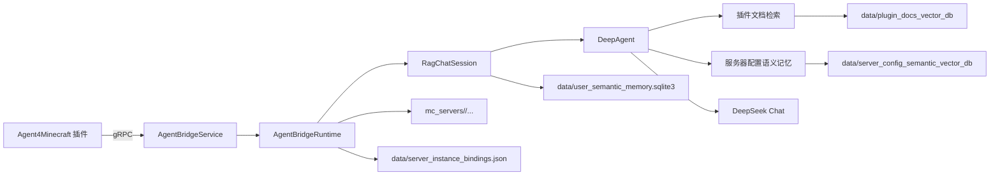

# AgentForMc Wiki

AgentForMc 是 Agent4Minecraft 项目的 AI 后端，负责接收 Minecraft 插件端请求，执行问答规划、插件文档检索、服务端配置语义记忆、答案生成和配置同步处理。

Minecraft 游戏内入口由 [Agent4Minecraft](https://github.com/EternalmBlue/Agent4Minecraft) 插件提供。本仓库运行在后端服务器中，通过 gRPC 暴露 `AgentBridgeService`。

## 仓库关系

| 仓库 | 角色 | 链接 |
| --- | --- | --- |
| AgentForMc | 后端 AI 服务、RAG、DeepAgent、语义记忆、gRPC bridge | https://github.com/EternalmBlue/AgentForMc |
| Agent4Minecraft | Minecraft 插件、命令入口、配置扫描、脱敏上传 | https://github.com/EternalmBlue/Agent4Minecraft |

## 核心能力

- gRPC `AgentBridgeService`
- `/askmc` 问答请求处理
- 插件文档向量检索
- 名称命中增强、向量检索、BM25
- 可选 BCE reranker
- DeepAgent 工具编排
- Minecraft 配置文件接收和保存
- 配置语义抽取和增量刷新
- 可选玩家长期记忆
- 服务端实例绑定和冲突检测
- LangSmith / OpenTelemetry 可观测性

## 架构图

## 后端负责什么

- 校验插件请求。
- 管理 gRPC token。
- 维护 `server.id` 与 `server_instance_id` 绑定。
- 调用 embedding 和 chat model。
- 检索插件文档。
- 检索上传后的服务器配置语义记忆。
- 抽取配置语义条目。
- 返回最终答案和引用摘要。

## 后端不负责什么

- 不直接注册 Minecraft 命令。
- 不扫描真实 Minecraft 服务端目录。
- 不修改插件端本地配置。
- 不决定游戏内消息格式。
- 不管理 Paper 插件生命周期。

## 推荐阅读顺序

1. [快速开始](Quick-Start)
2. [后端配置](Configuration)
3. [数据目录与向量库](Data-Stores)
4. [gRPC Bridge](Grpc-Bridge)
5. [问答架构](QA-Architecture)
6. [配置同步与语义记忆](Config-Sync-and-Semantic-Memory)
