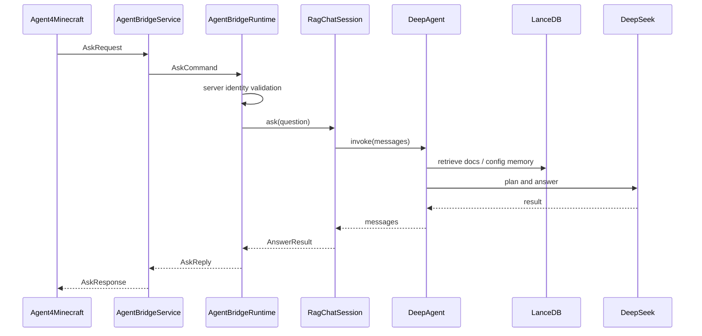

# 问答架构

`Ask` 请求来自插件端 `/askmc <问题>`。

## 总体流程



## Session 作用域

后端按以下格式建立会话作用域：

```text
<server.id>:<player_id 或 player_name>
```

作用：

- 保持短期对话历史。
- 隔离不同服务器和玩家上下文。
- 作为长期记忆作用域。

## DeepAgent 工具

当前会注册多类工具：

- 文档检索选择工具。
- 插件文档检索工具。
- 插件配置语义记忆工具。
- 查询改写工具。
- 查询扩展工具。
- HyDE 工具。
- 多查询 RAG 工具。
- 规划工具。
- 检索新鲜度判断工具。
- 回答质量判断工具。
- 配置语义刷新工具。

## 插件文档检索

检索源：

```text
data/plugin_docs_vector_db
```

检索策略：

- 插件名直接命中增强。
- embedding 向量检索。
- BM25 全文检索。
- RRF 融合。
- 可选 BCE reranker 重排。

## 服务端配置语义记忆

来源：

```text
mc_servers/<server.id>/...
```

刷新后写入：

```text
data/server_config_semantic_vector_db
```

用途：

- 回答和当前服务器配置有关的问题。
- 根据已上传配置查找插件参数、文件位置、规则和限制。

## 长期记忆

可选启用：

```toml
[memory]
enabled = true
```

长期记忆只作为参考上下文，不应作为插件文档检索证据。

## AnswerResponse

返回给插件：

- `request_id`
- `answer`
- `citations_summary`
- `backend_trace_id`

普通玩家默认只看到答案；引用摘要可以后续扩展为管理员或 debug surface。
